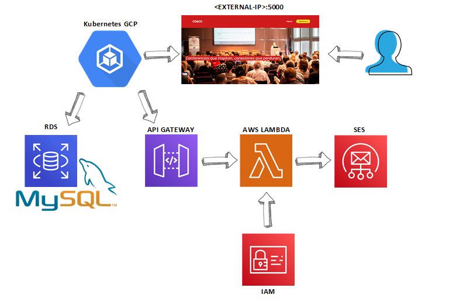

# Proyecto Final Cloud
Migración de una aplicación en la nube.

## Integrantes
- Javier Mazariegos
- Lorena Pérez

## Servicios:
-	IAM: Gestión de roles para el acceso entre servicios.
-	Simple Email Service (SES): Configuración y verificación para el envío de correos.
-	AWS Lambda: Función que envía los datos necesarios de las conferencias en la estructura del correo.
-	Api Gateway: Desencadenador de la función Lambda para el envío de correos.
-	Amazon RDS: Almacena los datos de los usuarios y las conferencias.
-	Kubernetes (GCP): despliegue y acceso público de la aplicación.

